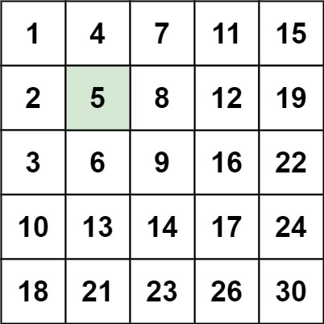
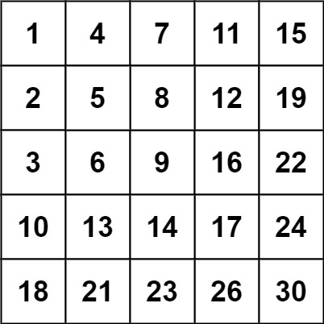

# 题目
编写一个高效的算法来搜索 m x n 矩阵 matrix 中的一个目标值 target 。该矩阵具有以下特性：

每行的元素从左到右升序排列。

每列的元素从上到下升序排列。

示例 1：

    输入：matrix = [[1,4,7,11,15],[2,5,8,12,19],[3,6,9,16,22],[10,13,14,17,24],[18,21,23,26,30]], target = 5
    输出：true
示例 2：

    输入：matrix = [[1,4,7,11,15],[2,5,8,12,19],[3,6,9,16,22],[10,13,14,17,24],[18,21,23,26,30]], target = 20
    输出：false

提示：

    m == matrix.length
    n == matrix[i].length
    1 <= n, m <= 300
    -109 <= matix[i][j] <= 109
    每行的所有元素从左到右升序排列
    每列的所有元素从上到下升序排列
    -109 <= target <= 109

来源：力扣（LeetCode）
链接：https://leetcode-cn.com/problems/search-a-2d-matrix-ii
著作权归领扣网络所有。商业转载请联系官方授权，非商业转载请注明出处。

# 解题方法
### 暴力破解
    时间复杂度O（mn） m*n的矩阵
    空间复杂度O（1）
### 搜索
    时间复杂度O（m+n）每次如果没有搜索到元素返回true，行和列递增或递减，循环结束前不超过m+n次。
    空间复杂度O（1）
    出发点的选取： 
        左上角：往左或者往右都是增大，所以不能选取
        右上角：往左减小往右增大，可选
        左下角：往上减小往右增大，可选
        右下角：往左或者网上都是减小，所以不能取
