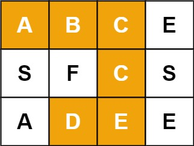

# 题目
给定一个 m x n 二维字符网格 board 和一个字符串单词 word 。如果 word 存在于网格中，返回 true ；否则，返回 false 。

单词必须按照字母顺序，通过相邻的单元格内的字母构成，其中“相邻”单元格是那些水平相邻或垂直相邻的单元格。同一个单元格内的字母不允许被重复使用。

 

示例 1：

    输入：board = [["A","B","C","E"],["S","F","C","S"],["A","D","E","E"]], word = "ABCCED"
    输出：true
示例 2：

    输入：board = [["A","B","C","E"],["S","F","C","S"],["A","D","E","E"]], word = "SEE"
    输出：true
示例 3：

    输入：board = [["A","B","C","E"],["S","F","C","S"],["A","D","E","E"]], word = "ABCB"
    输出：false

    提示：
    
    m == board.length
    n = board[i].length
    1 <= m, n <= 6
    1 <= word.length <= 15
    board 和 word 仅由大小写英文字母组成

来源：力扣（LeetCode）
链接：https://leetcode-cn.com/problems/word-search
著作权归领扣网络所有。商业转载请联系官方授权，非商业转载请注明出处。

# 解题方法
### DFS回溯
    1.双重循环找到字符串的起点
    2.基于起点上下左右四个方向找剩余路径
    3.在找的过程中判断选择是否正确，是否越界，是否已访问过
    4.声明一个变量保存访问过的元素
    5.如果递归下一个节点时错误的，说明当前选择也是错误的，需要把当前元素的是否访问状态改回未访问
    
    时间复杂度O(MN*3^L) M,N为网格的长宽 L为字符串长度 每次递归除了第一次可以进入4个分支，
    其余最多进入3个分支，因为每个位置只能一次，走过无法再访问。
    空间复杂度O(MN) 开辟存储是否访问过的数组
    如果采用修改原数组的方法 空间复杂度O(1)
