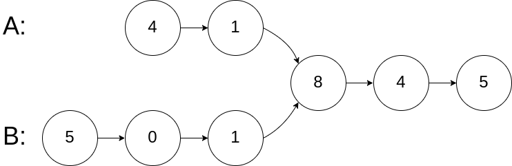

# 题目
编写一个程序，找到两个单链表相交的起始节点。

如下面的两个链表：

在节点 c1 开始相交。

示例 1：

输入：intersectVal = 8, listA = [4,1,8,4,5], listB = [5,0,1,8,4,5], skipA = 2, skipB = 3

输出：Reference of the node with value = 8

输入解释：相交节点的值为 8 （注意，如果两个链表相交则不能为 0）。从各自的表头开始算起，链表 A 为 [4,1,8,4,5]，链表 B 为 [5,0,1,8,4,5]。在 A 中，相交节点前有 2 个节点；在 B 中，相交节点前有 3 个节点。

注意：
如果两个链表没有交点，返回 null.

在返回结果后，两个链表仍须保持原有的结构。

可假定整个链表结构中没有循环。

程序尽量满足 O(n) 时间复杂度，且仅用 O(1) 内存。

来源：力扣（LeetCode）
链接：https://leetcode-cn.com/problems/intersection-of-two-linked-lists
著作权归领扣网络所有。商业转载请联系官方授权，非商业转载请注明出处。
# 解题思路

### 对齐起点遍历
    两个链表一前一后触发，不能一起走到公共节点。
    让步长的先走，对齐起跑线后同时出发。

### 指针从头遍历
    分别为链表A和链表B设置指针A和指针B，然后开始遍历链表，如果遍历完当前链表，则将指针指向另外一个链表的头部继续遍历，直至两个指针相遇。
    两指针分别走过的路径为：
    指针A :a+c+b
    指针B :b+c+a
    明显 a+c+b = b+c+a,如果两个链表相交，则指针A和指针B必定在相交结点相遇。

### 暴力破解法
    双重循环，注意:内层循环遍历后需要使指针回到起始位置

### 哈希表法
    1、遍历其中一个链表，将链表指针存储哈希表中
    2、遍历另一个链表，判断节点是否已经存在链表中