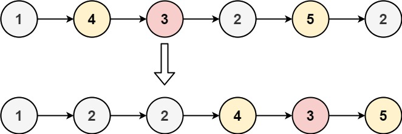

# 题目
87. 分隔链表
    给你一个链表的头节点 head 和一个特定值 x ，请你对链表进行分隔，使得所有 小于 x 的节点都出现在 大于或等于 x 的节点之前。

你应当 保留 两个分区中每个节点的初始相对位置。

    示例 1：

    输入：head = [1,4,3,2,5,2], x = 3
    输出：[1,2,2,4,3,5]

    示例 2：
    
    输入：head = [2,1], x = 2
    输出：[1,2]

    提示：
    
    链表中节点的数目在范围 [0, 200] 内
    -100 <= Node.val <= 100
    -200 <= x <= 200

# 解题思路
### 模拟
    1.模拟法 和两链表合并的题目类似
    2.需要维护两个链表，一个链表保存所有小于x值的链，一个链表保存所有大于x值的链
    3.最后将两个链表就行合并即可
    4.注意利用虚拟头节点指向第一个节点，便于最后结果的返回
    5.注意最后要将维护的大于x值链表末尾节点的Next值设置为nil,否则程序会继续往下导致内存错误