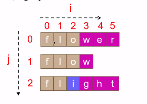

# 题目
编写一个函数来查找字符串数组中的最长公共前缀。

如果不存在公共前缀，返回空字符串 ""。

 

    示例 1：
    
    输入：strs = ["flower","flow","flight"]
    输出："fl"
    示例 2：
    
    输入：strs = ["dog","racecar","car"]
    输出：""
    解释：输入不存在公共前缀。
    
    
    提示：
    
    0 <= strs.length <= 200
    0 <= strs[i].length <= 200
    strs[i] 仅由小写英文字母组成

来源：力扣（LeetCode）
链接：https://leetcode-cn.com/problems/longest-common-prefix
著作权归领扣网络所有。商业转载请联系官方授权，非商业转载请注明出处。

# 解题方法
### 横向扫描
    时间复杂度O（mn） m是字符串数组中字符平均长度，n是字符串数量。
    最坏情况下字符串数组中每个字符都会被比较一次。
    空间复杂度O（1）
    
    思路：遍历字符串数组项获取最终公共前缀，
         定义公共前缀变量prefix，初始化值为第一个元素，
         每次循环拿上一次比较获得的公共前缀与当前遍历元素比较获取公共前缀，再赋值给prefix
         如果某次比较获取的公共前缀长度为0，可以直接返回。
### 纵向扫描

    时间复杂度O（mn）空间复杂度O（1）
    思路：字符串数组元素个数为行数
         字符串数组第一个元素长度作为列数
         双重循环进行比较，外层循环为列，内层循环为行
         循环内判断列是否已经走到尽头，
         j行i列与第一元素的i列元素是否相等，
         如果不相等，返回前面相等的公共前缀，
         如果循环结束都相等，则说明第一个元素为最长公共前缀。

### 二分法
    时间复杂度O（mnlogm）m是字符串数组中字符串的最小长度，n是字符串数量
    二分查找迭代执行次数是O（logm），每次迭代最多需要比较mn个字符
    空间复杂度O（1）